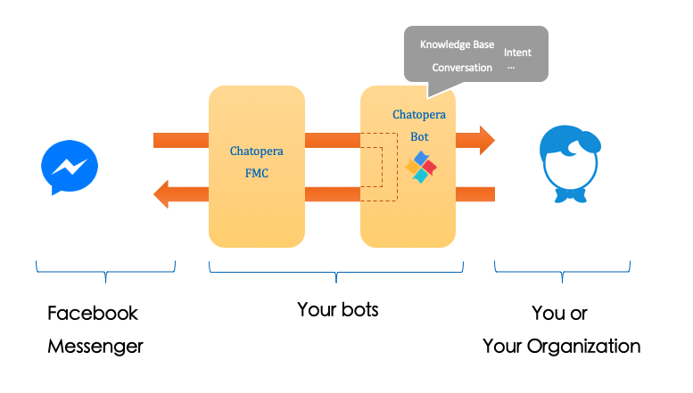
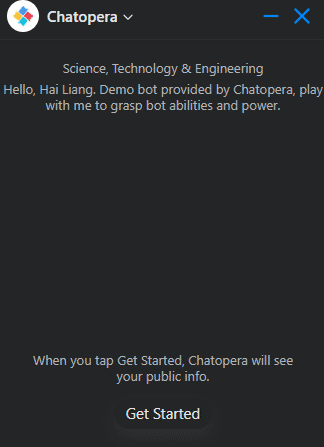
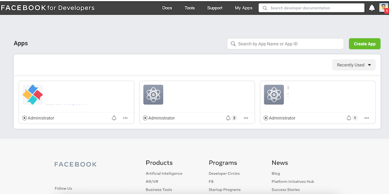
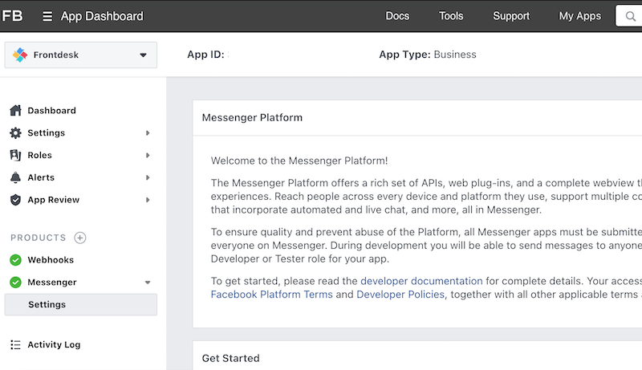
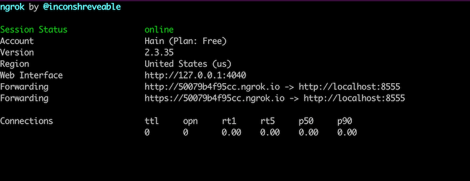
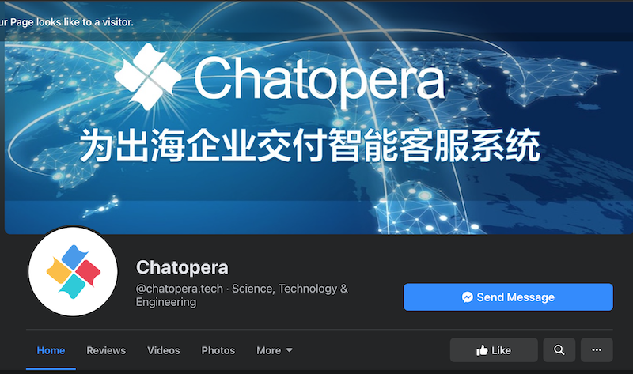
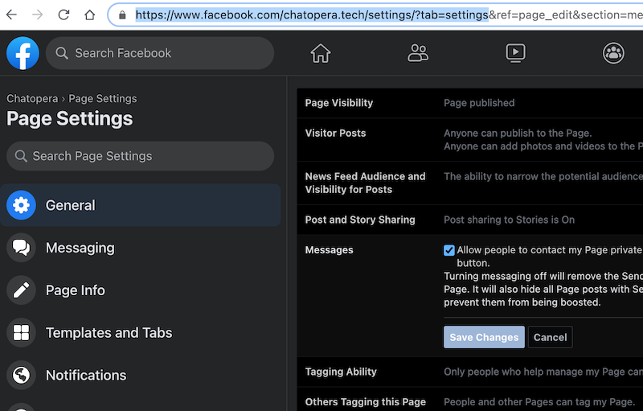
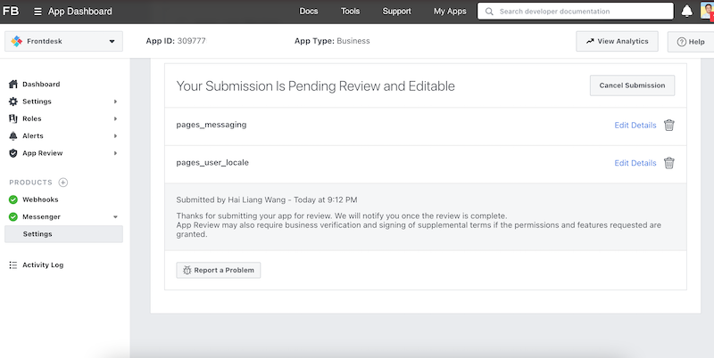
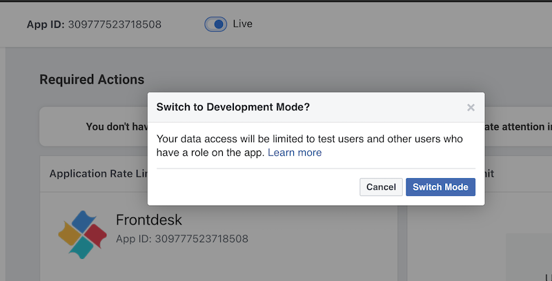

<div align=right>

[Main](https://github.com/chatopera/chatopera.fmc)　|　[Bot Customization Guide](https://github.com/chatopera/chatopera.fmc/blob/master/extras/bot.md)　|　[Engineering](https://github.com/chatopera/chatopera.fmc/blob/master/extras/engineering.md)　|　[Get Help](https://docs.chatopera.com/products/chatbot-platform/support.html)

</div>

# Chatopera FMC, Facebook Messenger Connector for Chatopera

[](https://microbadger.com/images/chatopera/fmc:develop "Image layers") [](https://microbadger.com/images/chatopera/fmc:develop "Image version") [](https://hub.docker.com/r/chatopera/fmc/) [](https://hub.docker.com/r/chatopera/fmc/) [](https://microbadger.com/images/chatopera/fmc:develop "Image CommitID")

Boot your bots in Facebook Messenger with [Chatopera](https://bot.chatopera.com/) in minutes.



If you decide to launch Chatbots on [Facebook Messenger Platform](https://developers.facebook.com/docs/messenger-platform) so that all your customers or target audiences can consume your services in the chatbot way via Facebook Messenger, you can run a software with source codes. There are many reasons to run a bot in such way, especially when you have technical skills, you want to leverage the most powerfull features in [Facebook Messenger Platform](https://developers.facebook.com/docs/messenger-platform).

As [Facebook Messenger Platform](https://developers.facebook.com/docs/messenger-platform) is changing and reshaping quickly, in order to use the latest APIs, you have to hands on and do some coding stuffs. Sometimes you want to intergates Facebook Messenger bot and other IT Systems like CRM, OA and 3rd party service together, the best way is starting your work with a project skeleton, this project skeleton has done some general features. Or what you need to do is just making configurations and running it, later your business requirements changes, you want to make some modifications, you would like to touch the source codes and rebuild the software. [Chatopera FMC](https://github.com/chatopera/chatopera.fmc) fits into such needs.

## Featured

- Services are running with docker containers, cross platform and OS
- Manage app status with [docker-compose](https://docs.docker.com/compose/install/), easy to run, backup, upgrade or restore
- Collect visitors' feedbacks during chats to improve bot further
- Support Multi Apps and Multi Pages in a single app with a configuration file
- Support Multi Locales and define a fallback locale as well
- Integrated with [Chatopera Cloud Service](https://bot.chatopera.com) for bot customization
  - Support image, button, generic templates, quick replies, typing status, etc. Learn more about [Messages in Facebook Messenger](https://developers.facebook.com/docs/messenger-platform/send-messages)
  - Build chat flows with Conversation Designer
  - Add FAQs in Web Portal
  - Bot Analisys and Lattice for tuning bots with chat histories

<details>
<summary>Collapse to get more about Chatopera Cloud Service</summary>
<p>

<p align="center">
  <b>Dicts</b><br>
  
</p>

<p align="center">
  <b>Entities</b><br>
  
</p>

<p align="center">
  <b>Intents</b><br>
  
</p>

<p align="center">
  <b>Slots</b><br>
  
</p>

<p align="center">
  <b>Train Machine Learning model</b><br>
  
</p>

<p align="center">
  <b>Write Chat Scripts with Conversation Designer</b><br>
  
</p>

<p align="center">
  <b>Test chats</b><br>
  
</p>

<p align="center">
  <b>Bot profile</b><br>
  
</p>

<p align="center">
  <b>Integrations</b><br>
  
</p>

<p align="center">
  <b>Chats History</b><br>
  
</p>
</p>
</details>

## Give me a demo

For desktop or mobile devices, click [http://m.me/chatopera.tech](http://m.me/chatopera.tech)

Or open Chatopera Facebook Page - [https://www.facebook.com/chatopera.tech/](https://www.facebook.com/chatopera.tech/). Click _Send Message_ to bring up the chatbox. There are just many ways to approach Messenger.



## Prerequisites

### Setup

- [Facebook Account](https://developers.facebook.com/docs/messenger-platform/getting-started/sample-apps/original-coast-clothing)
  - Facebook Page
  - Facebook Developer Account
- [Docker](https://docs.docker.com/) & [Docker Compose](https://docs.docker.com/compose/install/)
- [Chatopera Cloud Service](https://bot.chatopera.com) Account

## Development

All requirements in [Setup](#Setup), with additionals:

- Node.js 10+, [FMC](https://github.com/chatopera/chatopera.fmc) is developed with JavaScript.
- Text Editor for JavaScript, e.g. [VS Code](https://code.visualstudio.com/).

Find more development knowledges in [Engineering Section](./extras/engineering.md).

**Mostly, you would work on `Setup` and [add bot chats abilities](./extras/bot.md). It is rare that you need to do FMC development stuffs, if you want some enhancements or provide feedbacks for FMC, please create an Issue first at [Issues](https://github.com/chatopera/chatopera.fmc/issues).**

In below documentation, I would talk about `Setup` and [Bot Customization](./extras/bot.md) mainly.

## Supports

If you come to any troubles, find us to get help with [Contact Us Link](https://docs.chatopera.com/products/chatbot-platform/support.html).

## Provision your bot service with Facebook Messenger and Chatopera FMC

### Step 1/12 Create a Facebook Page

Just login facebook and then click [create](https://www.facebook.com/pages/creation/?ref_type=comet_home), you can design your page from here with a Designer Portal, very straight forward.

### Step 2/12 Join Facebook Developers Program

Open [https://developers.facebook.com/apps](https://developers.facebook.com/apps) and register account.

### Step 3/12 Create App in Facebook Developer Portal



### Step 4/12 Add Messenger from Products list

After your app is created, go to application detail page, from the left sidebar, find section of 'PRODUCTS'. Click '+' and filter 'Messenger', select it.



Make sure you can see `Messenger` appears in your left sidebar now. Collapse `Messenger` and click `Settings`, scroll down this page and find `Add or Remove pages`, just fill in your page created previously.

Keep in mind, `Messenger Settings Page` of Developer Portal is a bridge that connects Your Facebook Page's Messenger Chatbox and [Chatopera FMC](https://github.com/chatopera/chatopera.fmc), these two components are core for your bot service. Your Messenger App would also be available from many other channles which implemented by Facebook Messenger.

Now, let's setup your [Chatopera FMC Instance](https://github.com/chatopera/chatopera.fmc), here, instance means a software running somewhere, such as your local Desktop or AWS Machines with these dependiences.

- Docker && Docker Compose, versions released after 2017.
- Access to Internet.
- HTTPS, [Chatopera FMC](https://github.com/chatopera/chatopera.fmc) would be requested by Facebook to handle messaging events. There are many ways to accomplish it, I would suggest using [ngrok](https://dashboard.ngrok.com/get-started/setup) for beginners, also demostrate how to use ngrok to setup HTTPS for [Chatopera FMC](https://github.com/chatopera/chatopera.fmc) later.

### Step 5/12 Download FMC

Open a terminal to run shell commands, for Windows users, please install [Git Bash](https://git-scm.com/download/win).

```
cd SOME_WHERE_AS_ROOT
git clone https://github.com/chatopera/chatopera.fmc.git
cd chatpera.fmc # This folder is referenced as $FMC_HOME in follow-up.
```

`SOME_WHERE_AS_ROOT` is location you want to persist FMC source codes and data, e.g. `~`.

### Step 6/12 Configuration

Basically, we need to configure two files: `.env` and `accounts.json`.

#### 6.1 .env

`.env` is used for customize Application level properties.

```
cd $FMC_HOME
cp sample.env .env
# edit .env with text editor
```

Open `.env` with a text editor, there are some variables and their default values, keep them in default value except `FMC_PORT`. `FMC_PORT` is on which port you want to run FMC Service, the default port is 8555, later this value would be used to setup HTTPS, FMC would listen on this port to receive events and send responses, make sure this value does not conflict with other Applications, setting its value to an available port is very important.

Other variables in `.env` are involved with more technology knowledges, please find more information in [Engineering Section](./extras/engineering.md).

#### 6.2 accounts.json

`accounts.json` stores credentails for authentication and authorization among your FMC instance, Facebook Messenger Platform and Chatopera Cloud Service, other settings in `accounts.json` are for customizing messages or behaviors of bot.

```
cd $FMC_HOME
cp fmc/app/config/accounts.json fmc/data/accounts.json
# edit fmc/data/accounts.json with text editor
```

`fmc/app/config/accounts.json` is just a template, you have to fill in your bot and page info. Let us take a close look at `accounts.json`.

```
[
  {
    "appName": "{{APP_NAME}}",
    "appId": "{{APP_ID}}",
    "appSecret": "{{APP_SECRET}}",
    "pages": [{ "pageId": "{{PAGE_ID}}", "access_token": "{{PAGE_ACCESS_TOKEN}}" }],
    "localeDefault": "{{LOCALE_DEFAULT}}",
    "chatopera": {
      "zh_CN": {
        "clientId": "{{BOT_CLIENT_ID}}",
        "secret": "{{BOT_CLIENT_SECRET}}",
        "custom": {
          "GREETING_TEXT": "美好的一天从一声问候开始，你好，我是某某某！",
          "GUESS_MSG": "推荐问题",
          "HELPFUL_MSG": "以上信息有帮助吗？",
          "HELPFUL_FEEDBACK_YES_BTN": "有帮助",
          "HELPFUL_FEEDBACK_NO_BTN": "没帮助",
          "CLICK_YES_MSG": [
            "感谢您的支持！",
            "祝您有美好的一天！",
            "期待再次为您服务。"
          ],
          "CLICK_NO_MSG": [
            "请优化检索条件再试一下。",
            "非常抱歉没有帮助您解决问题，机器人客服的技能还在提升！",
            "非常抱歉，稍后为您转人工处理，请耐心等待或发送邮件到 some@email.com"
          ]
        }
      },
      "en_US": {
        "clientId": "",
        "secret": "",
        "custom": {
          "GREETING_TEXT": "A good day starts with a greeting, hello, I am Whatever you want ...",
          "GUESS_MSG": "Ask instead for",
          "HELPFUL_MSG": "Was this information helpful?",
          "HELPFUL_FEEDBACK_YES_BTN": "Yes",
          "HELPFUL_FEEDBACK_NO_BTN": "Nope",
          "CLICK_YES_MSG": [
            "Wow, that's great!",
            "Have a nice day.",
            "Glad to know that."
          ],
          "CLICK_NO_MSG": [
            "Please retry other words.",
            "Sorry about that, we would enhance the knowledge further.",
            "Bot is still improving right now, so, please request for a human."
          ]
        }
      }
    }
  }
]
```

| KEY                      | DESCRIPTION                                                                                                                                                                                                                                                                                                                                                                                       | SAMPLE                                                               |
| ------------------------ | ------------------------------------------------------------------------------------------------------------------------------------------------------------------------------------------------------------------------------------------------------------------------------------------------------------------------------------------------------------------------------------------------- | -------------------------------------------------------------------- |
| APP_NAME                 | Remember you have create an app in Facebook Developer Portal? `APP_NAME` is the Application's name.                                                                                                                                                                                                                                                                                               | Frontdesk                                                            |
| APP_ID                   | Just copy `App ID` in the app page, it's a numeric string                                                                                                                                                                                                                                                                                                                                         | 309777523718                                                         |
| PAGE_ID                  | Go to `Messenger Settings Page`, find the pageId value                                                                                                                                                                                                                                                                                                                                            | 1541840459186                                                        |
| PAGE_ACCESS_TOKEN        | In `Messenger Settings Page`, scorll down to `Access Tokens`, click `Generate Token` for your page.                                                                                                                                                                                                                                                                                               | EAAEZAvbNCuWwBAAyvmG                                                 |
| BOT_CLIENT_ID            | Go to [Chatopera Cloud Service](https://bot.chatopera.com), create a bot which `language` is set as `zh_CN`, navigate to `Bot Settings` page, copy the `Client Id` value.                                                                                                                                                                                                                         | 5fbf25f3cad362                                                       |
| BOT_CLIENT_SECRET        | In `Bot Settings`page, `Secret` just close to `Client Id`, click '复制'.                                                                                                                                                                                                                                                                                                                          | 0887749917bea4b8541                                                  |
| LOCALE_DEFAULT           | Facebook Messenger can progogate visitor's locale which would be helpful if you want to support multi languages. The fallback language is configured with `LOCALE_DEFAULT`, `zh_CN` for 简体中文, `zh_TW` for 繁体中文, `en_US` for US English, find out other locale codes in [Supported Locales](https://developers.facebook.com/docs/messenger-platform/messenger-profile/supported-locales/). | zh_CN                                                                |
| GREETING_TEXT            | Before visitor chats with your messenger bot, what would your want to tell them at the first glance? Find out what is [Greeting Text](https://developers.facebook.com/docs/messenger-platform/discovery/welcome-screen).                                                                                                                                                                          | A good day starts with a greeting, hello, I am Whatever you want ... |
| GUESS_MSG                | When visitor says something bot can not understand, bot would still reply politely with some potential questions the visitor could ask instead, `GUESS_MSG` is hint to explain such purpose.                                                                                                                                                                                                      | Ask instead for                                                      |
| HELPFUL_MSG              | If bot replies to visitor, is the response helpful? `HELPFUL_MSG` is asking for feedback.                                                                                                                                                                                                                                                                                                         | Was this information helpful?                                        |
| HELPFUL_FEEDBACK_YES_BTN | Used along with `HELPFUL_MSG`, text displayed to collect `positive` feedback.                                                                                                                                                                                                                                                                                                                     | Yes                                                                  |
| HELPFUL_FEEDBACK_NO_BTN  | Used along with `HELPFUL_MSG`, text displayed to collect `negative` feedback.                                                                                                                                                                                                                                                                                                                     | Nope                                                                 |
| CLICK_YES_MSG            | This is an array of text, send to visitor when they clicks `HELPFUL_FEEDBACK_YES_BTN`                                                                                                                                                                                                                                                                                                             | ['thanks', 'have a nice day.']                                       |
| CLICK_NO_MSG             | This is an array of text, send to visitor when they clicks `HELPFUL_FEEDBACK_NO_BTN`                                                                                                                                                                                                                                                                                                              | ['thanks', 'Sorry, please request for a human service.']             |

<details>
<summary>Collapse to get an example with values</summary>
<p>

```
[
  {
    "appName": "Frontdesk",
    "appId": "1541840459186",
    "appSecret": "EAAEZAvbNCuWwBAAyvmGhlB4aWk",
    "pages": [
      {
        "pageId": "1541840459186685",
        "access_token": "EAAEZAvbNCuWwBA"
      }
    ],
    "localeDefault": "zh_CN",
    "chatopera": {
      "zh_CN": {
        "clientId": "5fbf25f3cad362001b4e",
        "secret": "0887749917bea4b85415066315e5",
        "custom": {
          "GREETING_TEXT": "你好，{{user_first_name}}。Chatopera 在 Messenger 上的演示 Bot，帮助您更好的了解对话机器人的能力。",
          "GUESS_MSG": "发送\"帮助\"或\"h\"获得导航信息，推荐问题",
          "HELPFUL_MSG": "以上信息有帮助吗？",
          "HELPFUL_FEEDBACK_YES_BTN": "有帮助",
          "HELPFUL_FEEDBACK_NO_BTN": "没帮助",
          "CLICK_YES_MSG": [
            "感谢您的支持！",
            "祝您有美好的一天！",
            "期待再次为您服务。"
          ],
          "CLICK_NO_MSG": [
            "请优化检索条件再试一下。",
            "非常抱歉没有帮助您解决问题，机器人客服的技能还在提升！",
            "非常抱歉，稍后为您转人工处理，请耐心等待或发送邮件到 info@chatopera.com"
          ]
        }
      },
      "en_US": {
        "clientId": "5fbf25f3cad362001b4e4",
        "secret": "0887749917bea4b8566315e4bc75",
        "custom": {
          "GREETING_TEXT": "Hello, {{user_first_name}}. Demo bot provided by Chatopera, play with me to grasp bot abilities and power.",
          "GUESS_MSG": "Send \"h\" to get help, ask instead for",
          "HELPFUL_MSG": "Was this information helpful?",
          "HELPFUL_FEEDBACK_YES_BTN": "Yes",
          "HELPFUL_FEEDBACK_NO_BTN": "Nope",
          "CLICK_YES_MSG": [
            "Wow, that's great!",
            "Have a nice day.",
            "Glad to know that."
          ],
          "CLICK_NO_MSG": [
            "Please retry other words.",
            "Sorry about that, we would enhance the knowledge further.",
            "Bot is still improving right now. Find more contacts on our website. https://www.chatopera.com/mail.html"
          ]
        }
      }
    }
  }
]
```

</p>
</details>

### Step 7/12 Run FMC

After you create the `.env` and `accounts.json` and docker & docker-compose are installed, let's start FMC with following commands.

```
cd $FMC_HOME
docker-compose up -d
docker-compose ps       # check container states
```

For the first time, it would take some minutes to download FMC docker images.

Make sure FMC is started as expected, use `docker-compose logs` to check logs.

```
docker-compose logs -f  # check logs
```

If you have seen something like this, it means the app is fully started and running.

```
      ___           ___           ___
     /\  \         /\__\         /\  \
    /::\  \       /::|  |       /::\  \
   /:/\:\  \     /:|:|  |      /:/\:\  \
  /::\~\:\  \   /:/|:|__|__   /:/  \:\  \
 /:/\:\ \:\__\ /:/ |::::\__\ /:/__/ \:\__\
 \/__\:\ \/__/ \/__/~~/:/  / \:\  \  \/__/
      \:\__\         /:/  /   \:\  \
       \/__/        /:/  /     \:\  \
                   /:/  /       \:\__\
                   \/__/         \/__/

==================== Powered by Chatopera Inc. =================
Facebook Messenger Connector for Chatopera
License Apache 2.0
Powered by https://github.com/chatopera/chatopera.fmc
版权所有 © 北京华夏春松科技有限公司️ https://www.chatopera.com/
----------------------------------------------------------------
server listening on port 8555
```

### Step 8/12 Host with HTTPS

You can choose many solutions to run FMC with HTTPS, I would suggest [ngrok](https://dashboard.ngrok.com/) for demo purpose, it is easy to use, assume FMC is running on 8555 port, run `ngrok` command in a terminal as below.

```
ngrok http 8555
```

Now, you would get a screen like this



So, HTTPS is hooked with your FMC instance, in our situation, `http://localhost:8555` is proxied as `https://50079b4f95cc.ngrok.io` via `ngrok`. Now, Facebook Messenger Platform can access your FMC instance with `https://50079b4f95cc.ngrok.io`.

Keep the `ngrok http 8555` command running, if it goes down, the requests would not be received by your FMC instance.

### Step 9/12 Update Callback URL for webhook

In `Messenger Settings Page`, scroll down to webhooks, click `Edit Callback URL`. Fill in your HTTPS URL with path and "works" as _Verify Token_, click `Verify and Save`.

```
https://YOUR_HTTPS_DOMAIN/webhook
```

As previous work with `ngrok`, the Callback URL is `https://50079b4f95cc.ngrok.io/webhook`.

### Step 10/12 Verify chatbox

Now, go to your Facebook Page, and view as `Visitor`. As you are admin of this Facebook page, URL of its Visitor view is something like.

```
https://www.facebook.com/YOUR_PAGE_PATH/?view_public_for=YOUR_PAGE_ID
```



Click `Send Message`, a chatbox is pop-up. If everything works, it would display the greeting message, and then click `Get started`.

Not get the `Send Message` Button? Maybe you should turn on `Messages` option in `Settings`, `Settings` URL is like `https://www.facebook.com/YOUR_PAGE_PATH/settings/?tab=settings`



### Step 11/12 Customize your bot

Now, your FMC instance, Chatopera Cloud Service and Facebook Page are connected, so, let's add chat abilities with [Chatopera Cloud Service](https://bot.chatopera.com).

Find quick start and other knowledges with [Bot Customization Guide](./extras/bot.md). In the quick start, you would get a powerful chatbot with several clicks.

With [Chatopera Cloud Service](https://bot.chatopera.com), you get a powerful toolkit to build bots, but getting a deep design or development skills is key to make great bot services, there are a lot books to help you for bot UX, e.g. [_Designing Bots: Creating Conversational Experiences_](https://www.oreilly.com/library/view/designing-bots/9781491974810/), [_Hooked: How to Build Habit-Forming Products_](https://www.amazon.com/Hooked-How-Build-Habit-Forming-Products/dp/1591847788).

### Step 12/12 Submission & Review Process

With all these works, you have a great bot that can deliver foods, book cab or tell jokes, how to publish it to public in Facebook?

Read [Submission & Review Process](https://developers.facebook.com/docs/messenger-platform/submission-process) from Facebook Messenger Platform.

I won't go to details, the Facebook guide tells very clearly. Currently, the only permission you need to request is `pages_messaging`.



`pages_user_locale` is not required, so I would suggest not add it into your submission for this time, later, you may support many locales in your bot, then submit another review.

At last, just switch your app from `Development` mode to `Live` mode.



## Congratulations

Your bot is alive, next you want to share it to your audiences. Read more about me link, chat plugin and other things in [Discovery & Re-engagement](https://developers.facebook.com/docs/messenger-platform/discovery).

You would still need to refine, enhance your bot's chats in days to come, but by the end of the day, you are going to touch millions people's life with your bot, cheers🍻!


## Contrib

Start to develop [FMC](https://github.com/chatopera/chatopera.fmc) project with [GUIDE](https://github.com/chatopera/chatopera.fmc/blob/master/extras/engineering.md), PRs are all welcome!

## References

[Requirements to deploy a Messenger app](https://developers.facebook.com/docs/messenger-platform/getting-started/sample-apps/original-coast-clothing)

[Build your first Messenger bot fast
](https://developers.facebook.com/docs/messenger-platform)

[Ngrok](https://dashboard.ngrok.com/)

## LICENSE

Copyright (2018-2020) <a href="https://www.chatopera.com/" target="_blank">北京华夏春松科技有限公司</a>

[Apache License Version 2.0](./LICENSE)

[![chatoper banner][co-banner-image]][co-url]

[co-banner-image]: https://static-public.chatopera.com/assets/images/42383104-da925942-8168-11e8-8195-868d5fcec170.png
[co-url]: https://www.chatopera.com
