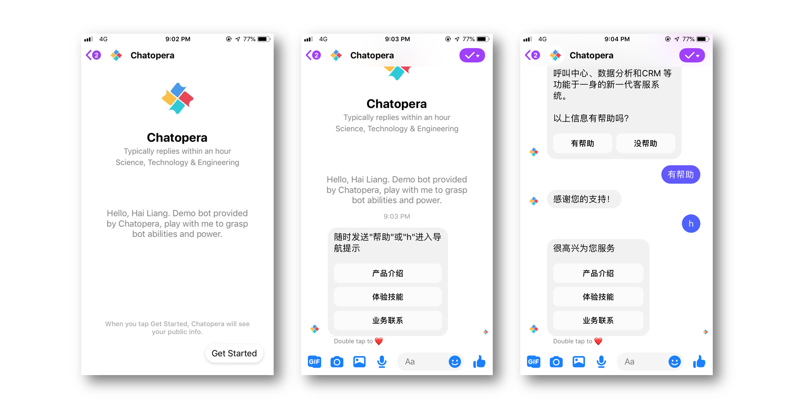

# Bot Customization Guide

Customize your bot with [Chatopera Cloud Service](https://bot.chatopera.com) to enable more chat abilities. Let's learn about Quick Start at first.

## What is in Quick Start Bot

With Quick Start, you can get a bot with following features:

### Tooltips

- A Welcome Message

A Welcome Message would catch people's most attentions, so it is the best opporunity to tell visitors what is bot's offerings.

- A Help Message for navigation

Whenever visitor inputs `帮助`, `h`, or `/`, he or she would get a Help Message.
This shortcut is very important, as visitor may lost in chats, or need hits to get your services.

### Answer Questions

In most situations, visitor would ask Frequent Asked Questions, and these questions can be replied with fixed answers. Under such scenario, you need to prepare some FAQ pairs, and import to bot. Bot would answer the matched questions to visitors and collect visitor's feedbacks whether FAQs are helpful. Here, I create serveral FAQ Samples for Quick Start.

### Play Word Games

You plan to deliver some real services via bot, the requirements become complicated, how to achieve that? In Quick Start, I prepare two Word Games.

- Tell a Joke

Just send `笑话`, bot would sends jokes in an interactive way.

- Guess the Number

Everytime bot would pick up a Number and you guess it. It is very interesting. You may attempt for five times. The bot would handle chat context.

These two Games are simple, but you can get the scripts in Quick Start, there are many powerful functions to help you build gorgeous games.

Also, you can experience the quick replies and other components provided by [Facebook Messenger Platform](https://developers.facebook.com/docs/messenger-platform) and integrated with [Chatopera Cloud Service](https://bot.chatopera.com).

## Get Quick Start

It's time to do some clicks, let's do it.

### Preparations

- Bot created on [Chatopera Cloud Service](https://bot.chatopera.com)
- Facebook Page connected to Bot on [Chatopera Cloud Service](https://bot.chatopera.com)

These two resources are provisioned by [FMC Readme](https://github.com/chatopera/chatopera.fmc), we are going to use them.

### Import FAQs

Download [Quick Start FAQs's json file](./bot/faq.json), navigate to Bot's FAQs page on [Chatopera Cloud Service](https://bot.chatopera.com), click `批量导入`, select `faq.json` and click `上传`.

After importing, you can find data in Bot's FAQs list.

### Import Conversations

Conversations are chats in multi rounds, `Tell a Joke` and `Guess the Number` are implemented with Conversations.

Chatopera make it a standard to develop conversations, multi conversations are packaged into a file with a suffix `.c66`. The Quick Start's conversations file can be downloaded as [MeFrontdeskBot.zh_CN.1.0.0.c66](./bot/releases/MeFrontdeskBot.zh_CN.1.0.0.c66).

After downloaded, navigate to Bot's Conversation page and click `导入`, select `MeFrontdeskBot.zh_CN.1.0.0.c66`, click `保存`. You can find there are four conversations in Conversation list now.

### Verify Chats

We are almost there, go to Bot's Test page and send `产品介绍`, make sure you get response alike.

### Chat with Facebook Messenger

Once the FAQs or Conversations is imported, they take effects, your audiences can use these services immediately.

So, for testing purpose, you can create another bot for develop bot and export FAQs and Conversations files, and then import them to your bot in production.

Congratulations! The Quick Start is done.

## Become a expert to build Chatbot

So, just a few clicks couldn't make you an expert. You can check out Quick Start's [Conversations Scripts](./bot/botarchive) to learn more. But to become expert or master, please take time to learn our online documentations.

- [Chatopera 机器人平台使用指南](https://ke.qq.com/course/2994143?quicklink=1)
- [Chatopera 云服务文档中心](https://docs.chatopera.com/products/chatbot-platform/index.html)
- [Chatopera 聊天机器人对话模板](https://github.com/chatopera/chatbot-samples)
- [Chatopera Deep Dive](http://www.bot5.club/events/seminar-minutes-2020-18/)

## LICENSE

Copyright (2018-2020) <a href="https://www.chatopera.com/" target="_blank">北京华夏春松科技有限公司</a>

[Apache License Version 2.0](../LICENSE)

[![chatoper banner][co-banner-image]][co-url]

[co-banner-image]: https://static-public.chatopera.com/assets/images/42383104-da925942-8168-11e8-8195-868d5fcec170.png
[co-url]: https://www.chatopera.com
